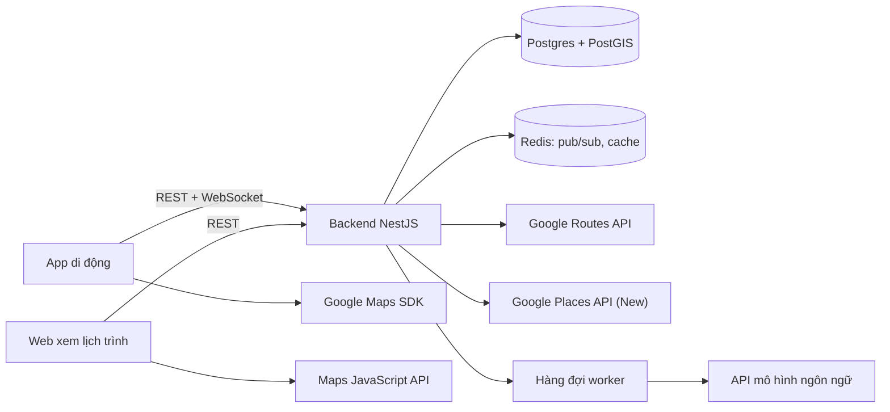
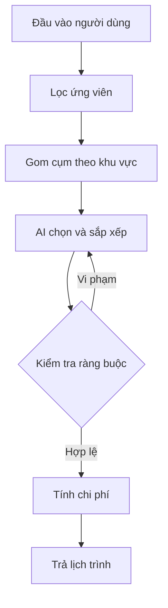

# PRD — Rong: Ứng dụng tổng hợp điểm vui chơi & lập lịch trình du lịch

| Thông tin | Chi tiết |
|---|---|
| Tên sản phẩm | Rong |
| Slogan | Rong thong dong |
| Phiên bản tài liệu | 1.0 — Đã chốt phạm vi MVP (các việc còn lại ở mục 15.3) |
| Ngày cập nhật | 18/09/2026 |
| Trạng thái | Đã chốt phạm vi; còn việc cần làm trước khi build (mục 15.3) |
| Người phụ trách | *(điền tên)* |
| Nền tảng | iOS, Android (app) + Web (trang xem lịch trình được chia sẻ) |

## Mục lục

1. Tổng quan
2. Mục tiêu & chỉ số thành công
3. Người dùng mục tiêu
4. Phạm vi MVP
5. User stories
6. Yêu cầu chức năng
7. Dữ liệu & nguồn dữ liệu
8. Yêu cầu phi chức năng
9. Kiến trúc kỹ thuật đề xuất
10. Danh sách màn hình
11. Đo lường (analytics)
12. Rủi ro & giảm thiểu
13. Lộ trình
14. Mô hình kinh doanh (sau MVP)
15. Câu hỏi mở & quyết định
- Phụ lục A — Bảng ánh xạ tên điểm đến
- Phụ lục B — Ví dụ cấu trúc dữ liệu lịch trình

---

## 1. Tổng quan

### 1.1 Bối cảnh & vấn đề

Trước mỗi chuyến đi, người dùng Việt Nam thường phải tự tổng hợp thông tin từ nhiều nơi: video TikTok, các group Facebook review địa phương, Instagram, Google Maps, blog du lịch. Quá trình này tốn nhiều giờ, thông tin rời rạc và nhanh lỗi thời. Cuối cùng, lịch trình vẫn phải ghép thủ công trong Notes, Excel hoặc tin nhắn Zalo. Khi đi theo nhóm, việc thống nhất "đi đâu, mấy giờ, hết bao nhiêu tiền" càng mất thời gian hơn.

Các nỗi đau chính:

- Thông tin phân tán trên nhiều nền tảng, khó biết chỗ nào đang thực sự được yêu thích.
- Không biết sắp xếp các điểm thế nào cho hợp lý về đường đi, giờ mở cửa, sức khỏe của trẻ nhỏ hay người lớn tuổi.
- Khó ước lượng tổng chi phí chuyến đi.
- Lên kế hoạch nhóm qua chat dễ rối, không có một phiên bản lịch trình thống nhất.

### 1.2 Giải pháp

Một ứng dụng di động cho phép người dùng:

1. **Khám phá:** tìm một điểm đến, xem ranh giới vùng đó trên bản đồ, cùng danh sách địa điểm vui chơi được tổng hợp và xếp hạng từ nhiều nguồn.
2. **Lập lịch trình:** nhận lịch trình gợi ý kèm ước tính chi phí, phù hợp với nhóm đi, thời gian và ngân sách; chỉnh sửa hoặc tự lập lịch trình.
3. **Đi cùng nhau:** tạo nhóm, chia sẻ và cùng chỉnh sửa lịch trình.

### 1.3 Tuyên bố giá trị

> Từ những chỗ đang được review nhiều nhất đến lịch trình cho cả nhóm, chỉ trong một phút.

**Slogan:** *Rong thong dong.*

### 1.4 Khác biệt so với sản phẩm hiện có

| Sản phẩm | Điểm mạnh | Hạn chế so với nhu cầu | Khác biệt của chúng ta |
|---|---|---|---|
| Google Maps | Dữ liệu địa điểm lớn, chỉ đường tốt | Không lập lịch trình, không phản ánh độ "hot" trên mạng xã hội | Xếp hạng có tín hiệu từ cộng đồng; lịch trình tự động |
| TripAdvisor | Nhiều review | Thiên về khách quốc tế; review tại Việt Nam ít và cũ | Dữ liệu và ngữ cảnh địa phương Việt Nam |
| Wanderlog | Lập lịch trình tốt | Dữ liệu địa phương Việt Nam mỏng; ít gợi ý theo đối tượng | Gợi ý theo nhóm đi (gia đình, bạn bè…) và chi phí bằng VNĐ |
| Group Facebook / TikTok | Nội dung mới, chân thực | Rời rạc, không tìm kiếm hay lập kế hoạch được | Gom nội dung về bản đồ và lịch trình |

---

## 2. Mục tiêu & chỉ số thành công

### 2.1 Mục tiêu sản phẩm (MVP)

- **G1:** Kiểm chứng người dùng thấy giá trị trong việc khám phá địa điểm được tổng hợp theo điểm đến.
- **G2:** Kiểm chứng lịch trình gợi ý đủ tốt để người dùng dùng thật mà không phải sửa nhiều.
- **G3:** Kiểm chứng vòng lặp lan truyền qua việc chia sẻ lịch trình trong nhóm.

**Chỉ số North Star:** số lịch trình được lưu và chia sẻ cho ít nhất một người khác mỗi tuần.

### 2.2 Chỉ số đo lường

*Các mục tiêu dưới đây là giả định ban đầu, cần hiệu chỉnh sau giai đoạn beta.*

| Chỉ số | Định nghĩa | Mục tiêu 3 tháng sau ra mắt |
|---|---|---|
| Activation | % người dùng mới tạo ≥ 1 lịch trình trong 24 giờ đầu | ≥ 35% |
| Chất lượng gợi ý | % lịch trình gợi ý được lưu với ≤ 30% số điểm bị thay đổi | ≥ 60% |
| Tỷ lệ chia sẻ | % lịch trình được chia sẻ cho ≥ 1 người | ≥ 25% |
| Hệ số lan truyền | Số người dùng mới đến từ link chia sẻ / số người dùng đã chia sẻ | ≥ 0,5 |
| Giữ chân D30 | % người dùng quay lại trong vòng 30 ngày | ≥ 15% |
| Share-to-app | Số lượt nhập nội dung từ mạng xã hội / người dùng hoạt động / tháng | ≥ 2 |
| Tốc độ tạo lịch trình | Từ lúc bấm "Gợi ý" đến khi có kết quả hoàn chỉnh | ≤ 20 giây (p90) |

### 2.3 Không phải mục tiêu (non-goals)

- Không làm nền tảng đặt phòng, đặt vé trong MVP.
- Không phủ toàn quốc ngay từ đầu.
- Không xây mạng xã hội riêng (feed, follow) trong MVP.
- Không thu thập (scrape) dữ liệu trái phép từ nền tảng bên thứ ba.

---

## 3. Người dùng mục tiêu

**Thị trường chính:** người Việt du lịch nội địa, 20–40 tuổi, dùng smartphone, quen khám phá địa điểm qua mạng xã hội.

### Persona A — Nhóm bạn trẻ: Linh, 24 tuổi, nhân viên văn phòng tại TP.HCM

- Đi chơi 2 ngày 1 đêm cùng 4–6 người bạn vài lần mỗi năm, thường đi xe máy hoặc thuê xe.
- Lưu hàng chục video TikTok về quán cà phê, điểm check-in nhưng không bao giờ tìm lại được.
- **Cần:** biết chỗ nào đang hot, lịch trình dày, chi phí chia đầu người rõ ràng, cả nhóm cùng xem một lịch trình.

### Persona B — Gia đình có con nhỏ: anh Minh, 34 tuổi, hai con 3 và 6 tuổi

- Đi 3 ngày 2 đêm vào các dịp lễ, đi ô tô.
- **Cần:** địa điểm phù hợp trẻ em, lịch thong thả có nghỉ trưa, tránh đường dốc và di chuyển xa, dự trù ngân sách cho cả nhà.

### Persona C — Cặp đôi / đi một mình: Hà, 28 tuổi

- Hay đi ngẫu hứng cuối tuần, thích quán có không gian đẹp, cảnh hoàng hôn.
- **Cần:** gợi ý nhanh, dễ tự chọn và sắp xếp.

---

## 4. Phạm vi MVP

### 4.1 Điểm đến khi ra mắt (đề xuất)

Ra mắt với **5 điểm đến** có dữ liệu được kiểm duyệt kỹ: Đà Lạt, Vũng Tàu, Phú Quốc, Đà Nẵng – Hội An, TP.HCM (khu trung tâm). Mở rộng dần dựa trên nhu cầu tìm kiếm thực tế (xem FR-1.8).

Lý do: chất lượng gợi ý là yếu tố giữ chân người dùng. Dữ liệu tốt ở 5 điểm đến có giá trị hơn dữ liệu nửa vời trên toàn quốc.

### 4.2 Trong phạm vi và ngoài phạm vi

| Nhóm tính năng | Trong MVP | Để sau (V2+) |
|---|---|---|
| Khám phá | Tìm điểm đến, ranh giới trên bản đồ, pin nổi bật, bottom sheet, lọc theo danh mục, chi tiết địa điểm | Bản đồ offline, tìm kiếm bằng ảnh |
| Dữ liệu | Nguồn mở/được phép, Google Places thời gian thực, curate thủ công, share-to-app | Pipeline tự động quy mô lớn, đối tác nội dung |
| Lịch trình | Tạo lịch trình từ địa điểm đã chọn (AI sắp xếp hoặc tự sắp xếp), thời gian bắt đầu/kết thúc theo ngày giờ, một điểm lưu trú cho cả chuyến, AI gợi ý quán ăn, ước tính chi phí, kéo thả, đổi điểm tương tự, chỉnh bằng câu lệnh | Chuyến đi nhiều điểm đến hoặc vùng rộng (ví dụ Đà Lạt + Mũi Né) với ngày di chuyển giữa các nơi; nhiều nơi lưu trú trong một chuyến; điểm đến/đi như sân bay, bến xe; tối ưu theo thời tiết thực tế |
| Nhóm | Tạo nhóm, mời bằng link, xem trên web không cần app, phân quyền, đồng bộ real-time | Bình chọn, bình luận, chia tiền, checklist đồ mang theo, chế độ "Đang đi" |
| Tài khoản | Đăng nhập Google / Apple / số điện thoại; dùng thử không cần đăng nhập | Hồ sơ công khai |

---

## 5. User stories

| ID | Là… | Tôi muốn… | Để… | Ưu tiên |
|---|---|---|---|---|
| US-01 | người dùng | tìm điểm đến bằng tên quen thuộc (kể cả tên trước sáp nhập) | thấy đúng khu vực mình định đi | P0 |
| US-02 | người dùng | thấy ranh giới điểm đến trên bản đồ | hình dung được phạm vi khu vực | P0 |
| US-03 | người dùng | xem danh sách địa điểm trong bottom sheet và lọc theo loại | nhanh chóng tìm chỗ hợp sở thích | P0 |
| US-04 | người dùng | thấy các địa điểm nổi bật nhất trên bản đồ | biết chỗ nào đáng đi nhất | P0 |
| US-05 | người dùng | biết vì sao một địa điểm được xếp hạng cao | tin tưởng kết quả | P1 |
| US-06 | người dùng | chia sẻ video/bài đăng từ TikTok, Facebook, Instagram vào app | lưu địa điểm trong đó lên bản đồ | P0 |
| US-07 | trưởng nhóm | nhận lịch trình gợi ý theo nhóm đi, số ngày, ngân sách | không phải tự sắp xếp từ đầu | P0 |
| US-08 | người dùng | thấy ước tính chi phí theo từng hạng mục | chuẩn bị ngân sách | P0 |
| US-09 | người dùng | kéo thả, đổi, xóa, thêm địa điểm trong lịch trình | lịch trình đúng ý mình | P0 |
| US-10 | người dùng | chỉnh lịch trình bằng câu nói tự nhiên | sửa nhanh mà không cần nhiều thao tác | P1 |
| US-11 | người dùng | gom địa điểm yêu thích rồi để app tự xếp lịch | kết hợp tự chọn và gợi ý | P0 |
| US-12 | trưởng nhóm | mời bạn bè vào nhóm qua link gửi bằng Zalo/Messenger | cả nhóm cùng xem một lịch trình | P0 |
| US-13 | người được mời | xem lịch trình trên web mà không cần cài app | nắm kế hoạch ngay lập tức | P0 |
| US-14 | thành viên nhóm | cùng chỉnh sửa lịch trình và thấy thay đổi ngay | không phải gửi qua gửi lại | P1 |
| US-15 | người dùng mới | dùng thử mà không cần đăng ký | trải nghiệm trước khi cam kết | P1 |

---

## 6. Yêu cầu chức năng

### 6.1 F1 — Tìm kiếm điểm đến & bản đồ ranh giới

**Mô tả:** Người dùng nhập tên tỉnh/thành hoặc điểm đến. App hiển thị ranh giới vùng đó trên bản đồ và nạp các địa điểm nằm bên trong từ danh mục riêng đã tổng hợp sẵn.

**Luồng (đã chốt 18/09/2026):**

1. Người dùng nhập tên tỉnh/thành, điểm đến du lịch hoặc xã/phường (ví dụ "Lâm Đồng", "Đà Lạt").
2. App hiển thị kết quả theo nhóm: tỉnh/thành (mới, cũ) → điểm đến du lịch trực thuộc → xã/phường, kèm ghi chú sáp nhập.
3. Người dùng chọn một kết quả, hoặc quay lại bước 1.
4. App truy vấn danh mục địa điểm riêng đã được tổng hợp sẵn (mục 7.5), lọc theo polygon của vùng đã chọn bằng tọa độ riêng.
5. Bản đồ hiển thị tối đa 5 marker có điểm cao nhất trong khung nhìn hiện tại; bottom sheet liệt kê toàn bộ địa điểm theo điểm giảm dần, mỗi lần tải 10, cuộn vô hạn. Thông tin Google (ảnh, rating, giờ mở cửa) lấy theo thời gian thực qua place_id.
6. Người dùng thêm địa điểm vào lịch trình hoặc danh sách "Muốn đi", rồi tự sắp xếp hoặc dùng công cụ sắp xếp của app (F6, F9).

**Yêu cầu:**

- **FR-1.1** Ô tìm kiếm có gợi ý khi gõ (autocomplete), hỗ trợ gõ không dấu ("da lat" → Đà Lạt) và chịu được lỗi chính tả nhẹ. Người dùng nhập được tên tỉnh/thành, điểm đến du lịch hoặc xã/phường.
- **FR-1.2** Hệ thống có hai loại vùng:
  - (a) *Đơn vị hành chính chính thức* (tỉnh/thành, xã/phường/đặc khu), lưu cả hai phiên bản địa giới: trước và sau sáp nhập có hiệu lực từ 1/7/2025 (xem FR-1.9).
  - (b) *Điểm đến du lịch* — polygon do đội ngũ tự định nghĩa theo cách người dùng hiểu (ví dụ "Đà Lạt", "Vũng Tàu", "Hội An").
- **FR-1.3** Có bảng bí danh (alias) ánh xạ tên cũ/tên quen thuộc sang vùng tương ứng (xem Phụ lục A). Khi người dùng tìm bằng tên cũ, hiển thị ghi chú, ví dụ: *"Vũng Tàu (nay thuộc TP. Hồ Chí Minh)"*.
- **FR-1.4** Kết quả hiển thị theo nhóm, theo thứ tự: (1) tỉnh/thành — phiên bản mới và cũ (FR-1.9); (2) điểm đến du lịch trực thuộc (Đà Lạt, Mũi Né, Bảo Lộc…); (3) xã/phường/đặc khu. Khi từ khóa khớp đúng tên một điểm đến (ví dụ "Đà Lạt"), điểm đến đó đứng đầu. Lưu ý: từ 1/7/2025 cấp huyện đã bị bỏ, kể cả các thành phố thuộc tỉnh như Đà Lạt, Bảo Lộc, Phan Thiết, nên các tên này được xử lý như điểm đến du lịch (polygon tự định nghĩa), không phải đơn vị hành chính.
- **FR-1.5** Sau khi chọn, bản đồ tự zoom vừa khít ranh giới; vùng bên ngoài được làm mờ, đường ranh giới được làm nổi bật.
- **FR-1.6** Người dùng có thể chọn danh mục trước khi tìm; mặc định là "Tất cả".
- **FR-1.7** Lưu lịch sử tìm kiếm gần đây (tối đa 10 mục).
- **FR-1.8** Với vùng chưa có dữ liệu trong danh mục riêng: vẫn hiển thị ranh giới, kèm thông báo chưa có dữ liệu và nút "Tôi muốn có điểm đến này" để ghi nhận nhu cầu. App **không** dùng API tìm kiếm của Google để tự tìm địa điểm cho vùng này; Google chỉ được gọi cho các địa điểm đã có trong danh mục do pipeline nền tạo ra (mục 7.5).
- **FR-1.9** Hiển thị song song địa giới cũ và mới cho tỉnh/thành có thay đổi do sáp nhập:
  - Khi người dùng tìm tên một tỉnh/thành có thay đổi địa giới, kết quả hiển thị **hai lựa chọn**. Ví dụ với "Lâm Đồng":
    - *Lâm Đồng (cũ)* — ranh giới trước 1/7/2025.
    - *Lâm Đồng (mới)* — ranh giới hiện hành, kèm mô tả ngắn phần được sáp nhập: "gồm thêm Bình Thuận cũ (Phan Thiết, Mũi Né) và Đắk Nông cũ".
  - Tỉnh/thành không thay đổi địa giới chỉ hiển thị một kết quả.
  - Khi tìm tên tỉnh cũ không còn tồn tại (ví dụ "Bình Thuận"), kết quả cũng hiển thị **hai lựa chọn**:
    - *Bình Thuận (cũ)* — ranh giới trước 1/7/2025, kèm ghi chú "nay thuộc Lâm Đồng".
    - *Lâm Đồng (mới)* — đơn vị hành chính hiện hành, kèm ghi chú "bao gồm Bình Thuận cũ".
  - Hai phiên bản dùng chung danh mục địa điểm; mỗi địa điểm được gán đồng thời vào vùng cũ và vùng mới chứa nó.
  - Nhãn "(cũ)" / "(mới)" luôn hiển thị trên tiêu đề bản đồ, bottom sheet và lịch trình để tránh nhầm lẫn.
  - Với vùng rộng như Lâm Đồng (mới), lịch trình nhiều ngày vẫn tuân theo bước gom cụm địa lý của F6, để mỗi ngày chỉ ở 1–2 khu vực.
- **FR-1.10** Sau khi người dùng chọn vùng, app truy vấn danh mục địa điểm riêng đã tổng hợp sẵn (mục 7.5); không đi tổng hợp dữ liệu từ internet hay mạng xã hội tại thời điểm tìm kiếm. Việc xác định địa điểm thuộc vùng nào (cũ, mới, xã/phường) chỉ dùng tọa độ riêng, không dùng tọa độ từ Google (mục 7.4).

**Tiêu chí chấp nhận:**

- Gõ "vung tau" trả về "Vũng Tàu" trong top 3 gợi ý.
- Gõ "lam dong" trả về cả "Lâm Đồng (cũ)" và "Lâm Đồng (mới)" trong top 3 gợi ý.
- Gõ "binh thuan" trả về "Bình Thuận (cũ)" (ghi chú "nay thuộc Lâm Đồng") và "Lâm Đồng (mới)" (ghi chú "bao gồm Bình Thuận cũ") trong top 3 gợi ý.
- Ranh giới hiển thị trong ≤ 2 giây với kết nối 4G.
- Chỉ các địa điểm có tọa độ nằm trong polygon mới xuất hiện trong danh sách. Tọa độ dùng để lọc lấy từ danh mục địa điểm riêng, không lấy từ Google (xem 7.4).

**Trường hợp biên:**

- Tên trùng ở nhiều nơi (ví dụ tên phường giống nhau ở nhiều tỉnh) → hiển thị kèm tên tỉnh/thành.
- Điểm đến du lịch trải qua nhiều đơn vị hành chính → dùng polygon điểm đến, không dùng ranh giới hành chính.

---

### 6.2 F2 — Bản đồ địa điểm nổi bật & bottom sheet

**Yêu cầu:**

- **FR-2.1** Bản đồ hiển thị tối đa 5 marker có điểm tổng hợp cao nhất trong khung nhìn hiện tại; top 5 được tính lại khi người dùng kéo hoặc zoom bản đồ. Các địa điểm còn lại chỉ hiển thị trong danh sách.
- **FR-2.2** Marker dùng ảnh riêng của app hoặc ảnh placeholder theo danh mục, không dùng ảnh Google; địa điểm "Đang hot" có nhãn riêng.
- **FR-2.3** Bottom sheet có 3 nấc:
  - *Thu gọn:* tên điểm đến, số lượng địa điểm, chip lọc.
  - *Nửa màn hình:* danh sách địa điểm, bản đồ vẫn nhìn thấy.
  - *Toàn màn hình:* danh sách đầy đủ.
- **FR-2.4** Chip lọc danh mục (chọn được nhiều): Tất cả, Check-in, Ăn uống, Cà phê, Thiên nhiên, Vui chơi cho bé, Văn hóa – lịch sử, Về đêm, Lưu trú.
- **FR-2.5** Bộ lọc phụ: phù hợp cho (trẻ em, người lớn tuổi, nhóm đông, cặp đôi), mức giá, đang mở cửa.
- **FR-2.6** Sắp xếp: Nổi bật (mặc định), Đang hot, Đánh giá cao, Gần tôi. Mọi cách sắp xếp dùng dữ liệu riêng của app; "Đánh giá cao" dùng điểm đánh giá riêng (điểm biên tập, sau này thêm đánh giá của người dùng trong app). Rating Google chỉ hiển thị ở màn hình chi tiết để tham khảo, không dùng để sắp xếp.
- **FR-2.7** Đồng bộ hai chiều giữa danh sách và bản đồ: chạm một mục trong danh sách → bản đồ di chuyển tới marker và làm nổi marker (với địa điểm ngoài top 5, hiện tạm marker của điểm đó); chạm marker → bottom sheet cuộn tới mục tương ứng.
- **FR-2.8** Khi người dùng kéo bản đồ ra khỏi khu vực ban đầu, hiện nút "Tìm trong khu vực này"; kết quả lấy từ danh mục riêng, không dùng API tìm kiếm của Google.
- **FR-2.9** Mỗi mục trong danh sách hiển thị: ảnh riêng của app hoặc placeholder (không dùng ảnh Google), tên, danh mục, điểm tổng hợp, mức giá, khoảng cách, một dòng lý do nổi bật, nút Lưu (tim) và nút "Thêm vào lịch trình". Ảnh và rating Google chỉ xuất hiện ở màn hình chi tiết (F5) và chỉ được gọi khi người dùng mở chi tiết địa điểm, để tiết kiệm chi phí.
- **FR-2.10** Danh sách trong bottom sheet gồm toàn bộ địa điểm của vùng (kể cả 5 điểm đang có marker), sắp xếp theo điểm tổng hợp giảm dần; cuộn vô hạn, tải 10 mục mỗi lần.
- **FR-2.11** Địa điểm chưa ghép được với Google (quán mới mở, điểm nhỏ): nếu có tọa độ riêng thì vẫn hiển thị marker; nếu không có thì chỉ hiển thị trong danh sách.
- **FR-2.12** Điểm lưu trú: không nằm trong xếp hạng và marker của chip "Tất cả", để không lấn át các điểm vui chơi; chỉ hiển thị khi người dùng chọn chip "Lưu trú". Mỗi điểm lưu trú có nút "Chọn làm nơi lưu trú" để dùng trong luồng tạo lịch trình (F6).

**Tiêu chí chấp nhận:**

- Cuộn danh sách và kéo bản đồ mượt (≥ 55 fps) trên thiết bị tầm trung.
- Thay đổi bộ lọc cập nhật danh sách và bản đồ trong ≤ 500 ms.

---

### 6.3 F3 — Xếp hạng & "độ hot"

**Yêu cầu:**

- **FR-3.1** Mỗi địa điểm có một điểm tổng hợp (0–100), tính **chỉ từ dữ liệu riêng của app** (không dùng dữ liệu Google, xem 7.4): điểm biên tập, độ phổ biến trong app và tín hiệu cộng đồng gần đây.
- **FR-3.2** Công thức khởi điểm (tinh chỉnh qua thử nghiệm A/B):

```
Điểm tổng hợp = 0,40 × Điểm_biên_tập
              + 0,30 × Độ_phổ_biến
              + 0,30 × Tín_hiệu_cộng_đồng

Điểm_biên_tập      : đội curate chấm 1–5 cho từng địa điểm khi kiểm duyệt;
                     về sau kết hợp đánh giá của người dùng trong app
                     (hiệu chỉnh Bayesian theo số lượng đánh giá)
Độ_phổ_biến        : lượt xem chi tiết, lượt lưu, lượt thêm vào lịch trình
                     (tích lũy toàn thời gian)
Tín_hiệu_cộng_đồng : lượt share-to-app, lượt lưu và thêm vào lịch trình
                     trong 30 ngày gần nhất (trọng số suy giảm theo thời gian)

Tất cả thành phần được chuẩn hóa về thang 0–100.
```

- **FR-3.3** Gắn nhãn "Đang hot" khi tín hiệu cộng đồng trong 14 ngày gần nhất tăng vượt ngưỡng so với mức trung bình của chính địa điểm đó và đạt số lượt tối thiểu (ngưỡng cụ thể xác định sau beta).
- **FR-3.4** Hiển thị lý do xếp hạng dễ hiểu, ví dụ *"Được lưu 120 lần tuần này"*. Rating Google (ví dụ *4,6★ · 2.300 đánh giá*) chỉ hiển thị ở màn hình chi tiết (F5): lấy theo thời gian thực khi người dùng mở chi tiết, có ghi công Google Maps và tách biệt trực quan khỏi điểm tổng hợp.
- **FR-3.5** Địa điểm tài trợ (nếu có sau này) không được ảnh hưởng tới điểm tổng hợp và phải gắn nhãn "Tài trợ".

> Rating Google không tham gia vào điểm tổng hợp hay bất kỳ cách sắp xếp nào; chỉ hiển thị ở màn hình chi tiết như thông tin tham khảo có ghi công Google Maps (FR-2.6, F5, mục 7.4).

---

### 6.4 F4 — Chia sẻ vào app (Share-to-app)

**Mô tả:** Người dùng chia sẻ link hoặc bài đăng từ TikTok, Facebook, Instagram, YouTube hoặc trình duyệt vào app. Hệ thống nhận diện địa điểm được nhắc tới và lưu lại cho người dùng.

**Yêu cầu:**

- **FR-4.1** App đăng ký Share Extension (iOS) và Share Intent (Android) để nhận URL và văn bản.
- **FR-4.2** Backend lấy metadata công khai của link (tiêu đề, mô tả, ảnh thu nhỏ qua oEmbed/Open Graph khi nền tảng cho phép), cùng văn bản người dùng gửi kèm.
- **FR-4.3** AI trích xuất tên địa điểm ứng viên và khớp với danh mục địa điểm của app (entity resolution); nếu chưa có trong danh mục, tìm qua Google Places API (Text Search) và chỉ lưu place_id. Nếu độ tin cậy thấp, cho người dùng chọn trong tối đa 3 ứng viên hoặc tự tìm.
- **FR-4.4** Nếu nội dung nhắc tới nhiều địa điểm (ví dụ "Top 10 quán cà phê Đà Lạt"), cho phép chọn nhiều địa điểm cùng lúc.
- **FR-4.5** Địa điểm được thêm vào mục "Đã lưu" của người dùng, kèm thẻ nhúng nội dung gốc và ghi rõ nguồn. Không sao chép toàn bộ nội dung.
- **FR-4.6** Mỗi lượt nhập thành công được ghi nhận làm tín hiệu cộng đồng (tổng hợp, ẩn danh).
- **FR-4.7** Xử lý bất đồng bộ; nếu mất quá 5 giây, gửi thông báo khi hoàn tất.
- **FR-4.8** Nếu không lấy được metadata, cho phép người dùng dán thêm mô tả hoặc chọn địa điểm thủ công.

**Tiêu chí chấp nhận:**

- ≥ 70% link hợp lệ nhận diện đúng ít nhất 1 địa điểm (đo trên bộ kiểm thử 200 link thực tế).

---

### 6.5 F5 — Chi tiết địa điểm

Màn hình chi tiết hiển thị:

- **Từ Google Places (chỉ gọi khi người dùng mở màn hình chi tiết):** ảnh, tên, địa chỉ, giờ mở cửa, rating và đánh giá. Hiển thị trong khối tách biệt, có ghi công Google Maps; ảnh và đánh giá ghi tên tác giả và có link mở bản gốc trên Google Maps.
- **Từ dữ liệu riêng:** danh mục, giá vé, điểm tổng hợp kèm lý do.
- **"Mọi người nói gì"** gồm hai phần tách biệt:
  - *Tóm tắt đánh giá của Google* qua Places API (kèm nội dung công bố và các link bắt buộc theo chính sách của Google; cần kiểm tra tính khả dụng cho Việt Nam và tiếng Việt).
  - *Tóm tắt của app*, chỉ từ nội dung cộng đồng và share-to-app: điểm cộng, điểm trừ, lưu ý thực tế (ví dụ "đông vào cuối tuần", "đường dốc, khó đẩy xe em bé"). Ghi rõ đây là tóm tắt tự động.
  - Không dùng AI của app để tóm tắt đánh giá lấy từ Google (xem 7.4).
- Nhãn phù hợp: trẻ em, người lớn tuổi, nhóm đông, cặp đôi.
- Thời điểm nên đến (ví dụ sáng sớm, hoàng hôn) và thời lượng tham quan gợi ý.
- Nội dung mạng xã hội liên quan (nhúng từ các lượt share-to-app).
- Nút hành động: Chỉ đường (mở Google Maps / Apple Maps), Lưu, Thêm vào lịch trình, Báo sai thông tin.

---

### 6.6 F6 — Tạo lịch trình

**Luồng (đã chốt 18/09/2026):**

1. **Điểm vào:** từ các địa điểm người dùng đã chọn ở luồng tìm kiếm (F1, bước 6), từ danh sách "Muốn đi" (F9), hoặc tạo lịch trình trống.
2. **Chọn cách lập:** *Dùng AI sắp xếp* hoặc *Tự sắp xếp*.
3. **Nhập thông tin chuyến đi** (bảng dưới). Nếu chọn cần lưu trú, người dùng chọn một điểm lưu trú.
4. **Tạo lịch trình:**
   - *AI sắp xếp:* theo quy trình AI bên dưới, kể cả gợi ý quán ăn cho các bữa.
   - *Tự sắp xếp:* app tạo khung các ngày theo thời gian bắt đầu và kết thúc; các địa điểm đã chọn nằm trong danh sách chờ để người dùng kéo vào từng ngày; người dùng tự chọn quán ăn. App vẫn tự tính thời gian di chuyển, chi phí và cảnh báo (F7, F8).
5. **Xem, chỉnh sửa (F8) và chia sẻ (F10).**

**Thông tin chuyến đi:**

| Trường | Giá trị | Bắt buộc |
|---|---|---|
| Điểm đến | Vùng đã chọn ở F1 | Có |
| Địa điểm đã chọn | Từ luồng tìm kiếm, "Muốn đi", hoặc danh sách địa điểm chung của nhóm (FR-10.9) | Không — nếu trống và chọn AI, AI tự chọn từ danh mục của vùng |
| Thời gian bắt đầu | Ngày + giờ | Có |
| Thời gian kết thúc | Ngày + giờ | Có |
| Ai đi | Nhóm bạn, Gia đình có trẻ nhỏ, Cặp đôi, Một mình, Có người lớn tuổi | Có |
| Số người | Người lớn, trẻ em | Có |
| Lưu trú | Cần / Không cần; nếu cần, chọn một điểm lưu trú (từ tìm kiếm với chip "Lưu trú" hoặc mục đã lưu) | Có |
| Cho phép AI gợi ý thêm địa điểm | Bật / Tắt, mặc định Bật | Chỉ khi chọn AI |
| Ngân sách | Tiết kiệm / Vừa phải / Thoải mái, hoặc số tiền mỗi người | Không (mặc định: Vừa phải) |
| Nhịp độ | Thong thả / Vừa / Dày | Không (mặc định theo đối tượng) |
| Phương tiện | Xe máy, Ô tô, Taxi/xe công nghệ | Không |
| Sở thích | Chọn nhiều danh mục | Không |
| Ghi chú | Văn bản tự do | Không |

Ràng buộc: thời gian kết thúc phải sau thời gian bắt đầu; độ dài tối đa một chuyến trong MVP là 7 ngày; MVP chỉ hỗ trợ một điểm lưu trú cho cả chuyến.

**Quy trình AI sắp xếp:**

1. **Xác định ứng viên:** địa điểm đã chọn là bắt buộc. Nếu cho phép, AI bổ sung địa điểm từ danh mục của vùng, phù hợp đối tượng, ngân sách, sở thích và mở cửa trong thời gian chuyến đi. Nếu có lưu trú, ứng viên bổ sung chỉ lấy trong phạm vi thời gian di chuyển hợp lý từ nơi ở (ngưỡng cấu hình được, mặc định 90 phút).
2. **Gom cụm địa lý:** chia ứng viên theo khu vực; mỗi ngày 1–2 cụm để tránh di chuyển qua lại.
3. **AI chọn và sắp xếp** cho từng buổi, có tính thời điểm đẹp và nghỉ ngơi; viết lý do ngắn cho mỗi lựa chọn. Điểm do AI thêm được gắn nhãn "AI gợi ý". AI có thể nhận giờ mở cửa và thời gian di chuyển từ Google theo nguyên tắc 5 ở mục 7.4.
4. **Chèn bữa ăn** theo khung giờ ở bảng dưới.
5. **Kiểm tra ràng buộc bằng thuật toán:** giờ mở cửa, thời gian di chuyển thực tế, tổng thời lượng mỗi ngày. Nếu vi phạm, tự sửa hoặc yêu cầu AI chọn lại.
6. **Tính chi phí** (F7) và trả kết quả.

**Mốc thời gian và lưu trú:**

- Ngày đầu bắt đầu từ thời gian bắt đầu; ngày cuối kết thúc trước thời gian kết thúc.
- Nếu có lưu trú: ngày đầu kết thúc tại nơi ở; các ngày giữa bắt đầu và kết thúc tại nơi ở; ngày cuối bắt đầu từ nơi ở. Thời gian di chuyển tới/từ nơi ở được tính vào lịch trình.
- Nếu không có lưu trú: mỗi ngày bắt đầu tại điểm đầu tiên của ngày đó.

**Bữa ăn (chỉ khi AI sắp xếp):**

| Bữa | Khung giờ mặc định (cấu hình được) | Thời lượng gợi ý |
|---|---|---|
| Sáng | 06:30 – 09:00 | 30 – 60 phút |
| Trưa | 11:00 – 13:30 | 45 – 90 phút |
| Tối | 17:30 – 20:30 | 60 – 90 phút |

- Chỉ xếp các bữa có khung giờ nằm trong thời gian chuyến đi.
- Ưu tiên quán ăn người dùng đã chọn; phần còn lại AI chọn quán trong danh mục "Ăn uống", gần điểm trước/sau, phù hợp ngân sách và đối tượng, gắn nhãn "AI gợi ý".
- Khi tự sắp xếp: app không tự thêm quán ăn; hiển thị cảnh báo thiếu bữa (FR-8.6) kèm nút tìm quán gần đó để người dùng tự chọn.

**Quy tắc theo đối tượng** (cấu hình được ở backend):

| Đối tượng | Số điểm/ngày | Quy tắc chính |
|---|---|---|
| Gia đình có trẻ nhỏ | 3–4 | Nghỉ trưa 2–3 tiếng; mỗi chặng di chuyển ≤ 45 phút; ưu tiên nhãn "phù hợp trẻ em"; không xếp hoạt động về khuya |
| Nhóm bạn trẻ | 5–7 | Có điểm check-in, ăn vặt, hoạt động về đêm; chấp nhận di chuyển xa hơn |
| Cặp đôi | 4–5 | Ưu tiên cảnh đẹp, quán có không gian, điểm ngắm hoàng hôn |
| Có người lớn tuổi | 3–4 | Tránh leo dốc, đi bộ nhiều; có thời gian nghỉ |

**Đầu ra:** lịch trình chia theo ngày → buổi (sáng, trưa, chiều, tối) → từng mục gồm: địa điểm, giờ bắt đầu–kết thúc, thời gian di chuyển từ điểm trước, chi phí ước tính, ghi chú/lý do, nhãn "AI gợi ý" (nếu có). Kèm tổng chi phí, danh sách cảnh báo và danh sách "Chưa xếp được". Xem ví dụ ở Phụ lục B.

**Yêu cầu:**

- **FR-6.1** Thời gian tạo ≤ 20 giây (p90); hiển thị dần từng ngày ngay khi có kết quả (streaming).
- **FR-6.2** Nút "Gợi ý phương án khác" tạo lịch trình khác biệt rõ rệt ở các điểm do AI thêm và thứ tự sắp xếp; các địa điểm người dùng đã chọn luôn được giữ. Mỗi lần bấm được tính là một lần chỉnh sửa bằng AI (FR-6.5).
- **FR-6.3** Mọi địa điểm trong lịch trình phải tồn tại trong cơ sở dữ liệu. Giờ mở cửa và giá được lấy từ dữ liệu, không do AI sinh ra.
- **FR-6.4** Nếu không đủ địa điểm phù hợp, thông báo rõ và đề xuất nới lỏng điều kiện.
- **FR-6.5** Cách tính lượt và giới hạn AI:
  - **Lượt AI:** chỉ tính ở lần đầu tạo lịch trình bằng AI (kể cả "Xếp lịch giúp tôi" ở F9). Mỗi tài khoản có **2 lượt mỗi tháng**.
  - **Chỉnh sửa bằng AI:** không tính lượt. Mỗi lịch trình được **tối đa 3 lần chỉnh sửa bằng AI**, gồm chỉnh bằng câu lệnh (FR-8.7) và "Gợi ý phương án khác" (FR-6.2) (hai thao tác này dùng chung 3 lần). Giới hạn tính theo lịch trình, dùng chung cho mọi thành viên có quyền trong nhóm.
  - App hiển thị số lần chỉnh sửa bằng AI còn lại, ví dụ "Còn 2/3 lần chỉnh sửa bằng AI". Hoàn tác một lần chỉnh sửa bằng AI không hoàn lại lần đã dùng.
  - Khi hết 3 lần, người dùng vẫn chỉnh sửa thủ công bình thường, hoặc tạo lịch trình mới bằng AI (tính 1 lượt).
  - Khi hết lượt tạo trong tháng, người dùng vẫn tự sắp xếp và chỉnh sửa thủ công; app thông báo thời điểm lượt được làm mới.
- **FR-6.6** Lượt AI khi làm việc theo nhóm: lượt tạo lịch trình luôn trừ vào **người trực tiếp bấm tạo lịch trình bằng AI**.
  - Nhóm được tạo trước khi tìm kiếm: chủ nhóm hoặc thành viên có quyền chỉnh sửa tìm địa điểm và tạo lịch trình bằng AI → trừ lượt của người đó.
  - Lịch trình được tạo trước khi lập nhóm → trừ lượt của người tạo lịch trình.
  - Chỉnh sửa bằng AI không trừ lượt của ai; mọi thành viên có quyền dùng chung 3 lần chỉnh sửa bằng AI của lịch trình (FR-6.5).
  - Người xem không dùng được tính năng AI. Người hết lượt không tạo được lịch trình bằng AI; thành viên khác còn lượt vẫn tạo được.
- **FR-6.7** Địa điểm đã chọn nhưng không xếp vừa (đóng cửa trong thời gian chuyến đi, quá xa nơi ở, không đủ thời gian) được đưa vào danh sách "Chưa xếp được" kèm lý do; người dùng có thể kéo vào lịch trình thủ công.
- **FR-6.8** Lịch trình được tạo trong một nhóm tự động thuộc nhóm đó và được chia sẻ cho các thành viên theo vai trò (F10).

**Tiêu chí chấp nhận:**

- 0% lịch trình chứa địa điểm không có trong cơ sở dữ liệu.
- ≥ 95% mục trong lịch trình không vi phạm giờ mở cửa (theo dữ liệu hiện có).
- 100% địa điểm người dùng đã chọn hoặc có trong lịch trình, hoặc nằm trong danh sách "Chưa xếp được".
- Với lịch trình AI, mỗi bữa có khung giờ nằm trong thời gian chuyến đi đều được xếp một quán ăn trong khung giờ đó.

---

### 6.7 F7 — Ước tính chi phí

**Yêu cầu:**

- **FR-7.1** Chi phí hiển thị dạng khoảng (thấp – cao), theo đầu người và tổng cả nhóm, đơn vị VNĐ.
- **FR-7.2** Tách theo hạng mục: vé tham quan/hoạt động, ăn uống, di chuyển tại điểm đến, lưu trú (chỉ tính khi người dùng chọn "Cần lưu trú" ở F6; ưu tiên giá của điểm lưu trú đã chọn, nếu thiếu thì dùng giá trung bình theo phân khúc). Chi phí di chuyển tới điểm đến để V2.
- **FR-7.3** Cách tính:
  - *Vé:* giá vé từ dữ liệu × số người (tách người lớn/trẻ em nếu có dữ liệu).
  - *Ăn uống:* mức giá trung bình theo loại quán và phân khúc × số bữa × số người.
  - *Di chuyển:* theo phương tiện × quãng đường (xăng/thuê xe máy, thuê ô tô, đơn giá taxi theo km).
  - *Lưu trú:* giá trung bình mỗi đêm theo phân khúc ngân sách tại điểm đến. Nguồn: tổng hợp từ Google, mạng xã hội và dữ liệu cộng đồng, trong phạm vi điều khoản cho phép. Cụ thể: dữ liệu cộng đồng (người dùng báo giá thực tế) và curate thủ công là nguồn chính được lưu trữ; nội dung mạng xã hội chỉ đi vào qua share-to-app; dữ liệu Google chỉ dùng theo thời gian thực, không lưu trữ (xem mục 7.4).
- **FR-7.4** Mọi con số có nhãn "Ước tính" và ngày cập nhật dữ liệu giá; mục thiếu dữ liệu hiển thị "Chưa có giá".
- **FR-7.5** Chi phí tự tính lại mỗi khi lịch trình thay đổi.
- **FR-7.6** *(P1)* Sau chuyến đi, mời người dùng báo giá thực tế để cải thiện dữ liệu.

---

### 6.8 F8 — Chỉnh sửa lịch trình

**Yêu cầu:**

- **FR-8.1** Kéo thả để đổi thứ tự trong ngày hoặc chuyển sang ngày khác.
- **FR-8.2** Xóa, thêm địa điểm (từ danh sách, ô tìm kiếm hoặc mục "Đã lưu").
- **FR-8.3** Nút "Đổi điểm tương tự": đề xuất 3 địa điểm cùng loại, ở gần, phù hợp đối tượng.
- **FR-8.4** Chỉnh giờ và thời lượng của từng mục.
- **FR-8.5** Sau mỗi thay đổi, tự tính lại thời gian di chuyển, giờ của các mục phía sau và chi phí.
- **FR-8.6** Cảnh báo (không chặn thao tác) khi: địa điểm đóng cửa vào giờ đó, một chặng di chuyển > 60 phút, một ngày có > 10 tiếng hoạt động, thiếu bữa trưa hoặc bữa tối.
- **FR-8.7** *(P1)* Chỉnh bằng câu lệnh tự nhiên, ví dụ: *"Bớt quán cà phê, thêm chỗ cho bé chạy nhảy vào chiều ngày 2"*. Hệ thống hiển thị bản xem trước các thay đổi để người dùng xác nhận trước khi áp dụng. Mỗi lần áp dụng tính vào giới hạn 3 lần chỉnh sửa bằng AI của lịch trình (FR-6.5); hủy ở bước xem trước thì không tính.
- **FR-8.8** Hoàn tác (undo) tối thiểu 10 bước.
- **FR-8.9** Tự động lưu.

---

### 6.9 F9 — Tự lập lịch trình

**Yêu cầu:**

- **FR-9.1** Người dùng thả tim địa điểm vào danh sách "Muốn đi", được nhóm theo từng điểm đến.
- **FR-9.2** Nút "Xếp lịch giúp tôi": mở luồng tạo lịch trình (F6) với danh sách "Muốn đi" làm địa điểm đã chọn.
- **FR-9.3** Cho phép tạo lịch trình trống và tự thêm từng điểm thủ công.
- **FR-9.4** Lịch trình tự lập vẫn có đầy đủ tính năng của F7 (chi phí) và F8 (chỉnh sửa).

---

### 6.10 F10 — Nhóm & chia sẻ

**Yêu cầu:**

- **FR-10.1** Tạo nhóm gắn với một hoặc nhiều lịch trình; đặt tên và ảnh bìa.
- **FR-10.2** Mời bằng link (deep link), có nút chia sẻ nhanh sang Zalo, Messenger và sao chép link.
- **FR-10.3** Link mở được trên web mà không cần cài app: trang chỉ xem, hiển thị đầy đủ lịch trình, bản đồ, chi phí, kèm nút "Mở trong app để chỉnh sửa". Link có ảnh xem trước đẹp khi gửi qua Zalo/Messenger.
- **FR-10.4** Phân quyền: *Chủ nhóm* (toàn quyền, quản lý thành viên), *Người chỉnh sửa*, *Người xem*. Vai trò mặc định của người được mời là *Người xem*; chủ nhóm có thể nâng quyền cho từng thành viên hoặc tạo link mời với quyền chỉnh sửa.
- **FR-10.5** Đồng bộ real-time: thay đổi hiển thị với các thành viên khác trong ≤ 2 giây; có nhật ký hoạt động đơn giản (ai vừa sửa gì).
- **FR-10.6** Xử lý xung đột ở cấp từng mục lịch trình: thay đổi sau ghi đè thay đổi trước trên cùng một mục, kèm thông báo cho người bị ghi đè.
- **FR-10.7** Chủ nhóm có thể thu hồi link mời và xóa thành viên.
- **FR-10.8** Thông báo đẩy khi có người tham gia hoặc lịch trình thay đổi (người dùng tắt được).
- **FR-10.9** Danh sách địa điểm chung của nhóm: khi nhóm được tạo trước khi tìm kiếm, các địa điểm mà chủ nhóm hoặc thành viên có quyền chỉnh sửa chọn từ luồng tìm kiếm được đưa vào danh sách chung; người xem chỉ xem. Danh sách này là "địa điểm đã chọn" khi tạo lịch trình trong nhóm (F6).

---

### 6.11 F11 — Tài khoản & onboarding

- Dùng thử không cần đăng nhập: tìm kiếm, xem địa điểm, tạo 1 lịch trình. Yêu cầu đăng nhập khi lưu lâu dài, chia sẻ hoặc tạo nhóm.
- Mỗi tài khoản có 2 lượt tạo lịch trình AI mỗi tháng (xem FR-6.5).
- Đăng nhập bằng Google, Apple, số điện thoại (OTP).
- Onboarding tối đa 3 màn hình; hỏi sở thích là tùy chọn.
- Xóa tài khoản và toàn bộ dữ liệu ngay trong app.

---

## 7. Dữ liệu & nguồn dữ liệu

### 7.1 Nguồn dữ liệu

| Nguồn | Dùng cho | Lưu ý / ràng buộc |
|---|---|---|
| OpenStreetMap | Ranh giới hành chính hiện hành; tên và tọa độ độc lập cho danh mục địa điểm | Giấy phép ODbL, bắt buộc ghi công; cần kiểm tra dữ liệu đã cập nhật địa giới sau sáp nhập chưa |
| Ranh giới trước sáp nhập | Phiên bản "(cũ)" ở FR-1.9 | Lấy từ bản dữ liệu OSM trước 7/2025 (ODbL) hoặc nguồn chính thức. Lưu ý: GADM không cho dùng thương mại nếu chưa xin phép |
| Polygon "điểm đến du lịch" tự xây | Vùng điểm đến theo cách hiểu của người dùng | Đội ngũ tự vẽ và duy trì |
| Google Places API (New) | Nguồn hiển thị chính: ảnh, rating, đánh giá, giờ mở cửa, địa chỉ; tìm địa điểm cho share-to-app | Gọi theo thời gian thực qua backend; chỉ lưu place_id; tuân thủ mục 7.4 |
| Google Routes API | Thời gian di chuyển giữa các điểm trong lịch trình | Gọi theo thời gian thực; không cache ngoài phạm vi điều khoản cho phép |
| Foursquare Places | Dữ liệu địa điểm bổ sung | Tuân theo điều khoản giấy phép |
| Cổng du lịch của Cục Du lịch Quốc gia và sở du lịch/văn hóa các tỉnh | Điểm du lịch được công nhận, lễ hội, sự kiện, giá vé | Dùng dữ kiện, không chép nguyên văn; kiểm tra điều khoản từng trang |
| Wikidata | Danh thắng, di tích, bảo tàng kèm tọa độ | CC0, dùng tự do |
| Wikivoyage, Wikipedia | Gợi ý điểm đến, mô tả, mẹo du lịch | CC BY-SA: dùng dữ kiện; nếu dùng lại câu chữ phải ghi nguồn và chia sẻ lại theo cùng giấy phép |
| Báo và blog du lịch (qua API tìm kiếm web có giấy phép thương mại) | Địa điểm mới, xu hướng | AI trích xuất tên địa điểm và dẫn link; không chép nội dung |
| YouTube Data API | Video review gắn với địa điểm, tín hiệu độ hot | Có giới hạn thời gian lưu dữ liệu, phải làm mới định kỳ |
| Curate thủ công | Nhãn đối tượng, thời lượng, thời điểm đẹp, giá | Nguồn chất lượng cao nhất cho 5 điểm đến đầu tiên |
| Share-to-app (người dùng) | Liên kết nội dung mạng xã hội, tín hiệu cộng đồng | Chỉ lưu metadata và thẻ nhúng, luôn ghi nguồn |
| Báo cáo và đề xuất của người dùng | Sửa thông tin sai, giá thực tế, đề xuất địa điểm mới, đánh giá, ảnh | Cần kiểm duyệt; tuân thủ Luật Bảo vệ dữ liệu cá nhân |
| Chủ doanh nghiệp tự đăng ký | Thông tin chính chủ, giờ mở cửa, giá | Cần quy trình xác minh; sau này có thể thành nguồn doanh thu |

**Nguyên tắc:** Không scrape Facebook, Instagram, TikTok; không dùng các API chỉ dành cho nghiên cứu (như TikTok Research API) vì không cho dùng thương mại. Mọi nội dung của bên thứ ba được hiển thị dạng nhúng hoặc link, kèm nguồn. Không sao chép tên, địa chỉ, đánh giá hay tọa độ từ Google Maps vào danh mục riêng, kể cả gõ tay lại.

### 7.2 Mô hình dữ liệu chính (rút gọn)

- **Region:** id, tên, loại (hành chính | điểm đến du lịch), phiên bản địa giới (trước | sau 1/7/2025), polygon, cấp hành chính, parent_id, vùng kế nhiệm (ví dụ Bình Thuận (cũ) → Lâm Đồng (mới)).
- **RegionAlias:** alias, region_id, ghi chú hiển thị (ví dụ "nay thuộc TP.HCM").
- **Place:** id, google_place_id, tên và tọa độ từ nguồn không phải Google (OSM, curate), danh mục, region_ids (gồm cả vùng cũ và mới), giá vé, nhãn phù hợp, thời lượng gợi ý, thời điểm đẹp, điểm biên tập, điểm tổng hợp, cờ "đang hot", ngày cập nhật. **Không lưu** rating, số đánh giá, giờ mở cửa, ảnh, đánh giá lấy từ Google.
- **PlaceMention:** place_id, nền tảng nguồn, url, ảnh thu nhỏ, ngày, người chia sẻ (ẩn danh khi tổng hợp).
- **PlaceSummary:** place_id, điểm cộng, điểm trừ, lưu ý, ngày tạo.
- **Itinerary:** id, owner_id, region_id, tham số đầu vào, chi phí tổng (min/max), ngày tạo/cập nhật.
- **ItineraryDay → ItineraryItem:** place_id, thứ tự, giờ bắt đầu/kết thúc, thời gian di chuyển, chi phí ước tính, ghi chú.
- **SavedPlace:** user_id, place_id, nguồn (thủ công | share-to-app).
- **Group, GroupMember** (vai trò), **InviteLink** (token, vai trò mặc định, hạn dùng, trạng thái), **ActivityLog**.

### 7.3 Tiêu chuẩn chất lượng dữ liệu

- Mỗi điểm đến lúc ra mắt có tối thiểu 150 địa điểm đã kiểm duyệt, phủ đủ các danh mục.
- Giá vé và dữ liệu curate được rà soát ít nhất mỗi quý.
- Địa điểm có ≥ 3 báo cáo "đã đóng cửa" bị ẩn tạm thời chờ kiểm tra.
- Theo dõi tỷ lệ báo sai trên mỗi 1.000 lượt xem địa điểm.

### 7.4 Nguyên tắc tuân thủ Google Maps Platform

Sản phẩm dùng hệ sinh thái Google (quyết định Q2). Nguồn điều khoản chính thức (bản cho khách hàng có địa chỉ thanh toán ngoài Khu vực Kinh tế châu Âu):

- Google Maps Platform Terms of Service — https://cloud.google.com/maps-platform/terms
- Google Maps Platform Service Specific Terms — https://cloud.google.com/maps-platform/terms/maps-service-terms
- Policies and attributions for Places API — https://developers.google.com/maps/documentation/places/web-service/policies

Nguyên tắc bắt buộc (tóm tắt theo bản đọc ngày 18/09/2026):

| # | Nguyên tắc | Căn cứ |
|---|---|---|
| 1 | Nội dung Google chỉ hiển thị trên bản đồ Google: app dùng Google Maps SDK, web dùng Maps JavaScript API. Không dùng bản đồ khác trong sản phẩm. | ToS 3.2.3(e); Service Specific Terms (Places) |
| 2 | Không lưu nội dung Google, trừ place_id (lưu vô thời hạn) và tọa độ (cache tối đa 30 ngày). Nội dung được gọi theo thời gian thực qua backend NestJS. | ToS 3.2.3(a), (b); Service Specific Terms |
| 3 | Danh mục địa điểm riêng có tên và tọa độ lấy từ nguồn không phải Google (OSM, curate). Việc lọc điểm trong polygon (FR-1) chỉ dùng tọa độ này. | ToS 3.2.3(c)(iv) |
| 4 | Điểm tổng hợp chỉ dùng tín hiệu riêng của app (FR-3). | ToS 3.2.3(a) |
| 5 | Dữ liệu Google chỉ được đưa vào AI cho **một mục đích duy nhất: sắp xếp lịch trình di chuyển phù hợp** (F6, F8, F9) — quyết định Q9-c. Điều kiện: chỉ gửi các trường tối thiểu (place_id, giờ mở cửa, thời gian di chuyển từ Routes API) theo từng yêu cầu; không lưu vào log hay cơ sở dữ liệu; không dùng để huấn luyện, kiểm thử, đánh giá hay tinh chỉnh mô hình; nhà cung cấp AI là **Gemini API, gói trả phí** (với dịch vụ trả phí, Google cam kết không dùng câu lệnh và câu trả lời để cải thiện sản phẩm). Bước kiểm tra ràng buộc bằng code (F6) vẫn giữ làm lớp an toàn. Có thể cân nhắc thêm Grounding with Google Maps của Gemini nếu cần. | ToS 3.2.3(a), (c)(vii) |
| 6 | Không dùng AI của app để tóm tắt đánh giá Google; dùng tóm tắt do Google cung cấp, kèm nội dung công bố và link bắt buộc. | ToS 3.2.3(c); Places API policies |
| 7 | Ghi công Google Maps (logo hoặc chữ "Google Maps"), tách biệt trực quan nội dung Google với nội dung khác; ghi tác giả ảnh/đánh giá và cho link mở bản gốc trên Google Maps. | ToS 3.2.2(b); Places API policies |
| 8 | Điều khoản sử dụng của app thông báo việc có tính năng và nội dung Google Maps, dẫn tới Điều khoản bổ sung của Google Maps và Chính sách quyền riêng tư của Google. | ToS 3.2.2(a) |

**Các điểm chưa rõ trong điều khoản và cách xử lý (Q9, chốt 18/09/2026):**

**(a) Dịch vụ danh bạ/listing — ToS 3.2.3(d)(iii).** Điều khoản nằm trong nhóm "không tái tạo sản phẩm của Google": không được dùng Google Maps để làm một dịch vụ mà giá trị chính là *danh sách các địa điểm/doanh nghiệp*, hoặc để tạo/bổ trợ sản phẩm quảng cáo. Sản phẩm phải có giá trị độc lập đáng kể ngoài Google.

- *Quyết định:* tạm không xin ý kiến luật sư; giảm rủi ro bằng thiết kế.
- *Các biện pháp đã áp dụng:* danh sách địa điểm dựng từ dữ liệu riêng; không dùng API tìm kiếm của Google để tự tìm địa điểm (FR-1.8, FR-2.8); ảnh và rating Google chỉ ở màn hình chi tiết; địa điểm tài trợ và affiliate chuyển sang MVP 2.
- Rủi ro còn lại được theo dõi ở mục 12.

**(b) Thay đổi kết quả tìm kiếm của Google — ToS 3.2.3(g).** Đã xử lý: app không hiển thị danh sách lấy từ API tìm kiếm của Google, và không sắp xếp theo rating Google; mọi cách sắp xếp dùng dữ liệu riêng (FR-2.6).

**(c) Dữ liệu Google trong AI.** Đã chốt: dùng Gemini API gói trả phí; dữ liệu Google chỉ dùng để sắp xếp lịch trình (nguyên tắc 5).

**Không dùng trong MVP:** Places Aggregate API, Nearby Search và Text Search ở dạng tìm kiếm tự do. Text Search chỉ dùng dạng lấy place_id để ghép địa điểm trong pipeline nền (mục 7.5).

### 7.5 Pipeline tổng hợp dữ liệu (chạy nền)

Dữ liệu địa điểm được tổng hợp trước và cập nhật định kỳ theo từng điểm đến; lúc người dùng tìm kiếm, app chỉ truy vấn danh mục riêng (FR-1.10).

1. **Thu thập** từ các nguồn ở mục 7.1. Tần suất đề xuất: bộ dữ liệu mở hằng tháng; bài viết và video hằng tuần; share-to-app và đề xuất của người dùng theo thời gian thực.
2. **Trích xuất** tên địa điểm, danh mục và dữ kiện liên quan từ nội dung văn bản bằng AI.
3. **Gộp trùng** các bản ghi cùng một địa điểm từ nhiều nguồn (entity resolution).
4. **Ghép place_id** bằng Google Text Search dạng chỉ lấy ID (miễn phí); chỉ lưu place_id.
5. **Gán vùng** bằng tọa độ riêng (nguồn mở, curate) hoặc ngữ cảnh nguồn; không dùng tọa độ Google.
6. **Kiểm duyệt** bởi đội curate: nhãn phù hợp, thời lượng, thời điểm đẹp, giá, điểm biên tập.
7. **Tính điểm tổng hợp** (FR-3) và cập nhật danh mục.

---

## 8. Yêu cầu phi chức năng

| Hạng mục | Yêu cầu |
|---|---|
| Hiệu năng | Mở app đến khi bản đồ sẵn sàng ≤ 3 giây; ranh giới + pin ≤ 2 giây (4G); lọc ≤ 500 ms; tạo lịch trình ≤ 20 giây (p90) |
| Thiết bị | iOS 17+, Android 10+ (xác nhận lại theo dữ liệu thị phần); chạy mượt trên máy tầm trung |
| Độ sẵn sàng | Uptime ≥ 99,5% |
| Ngôn ngữ | Chỉ tiếng Việt; tiếng Anh chưa nằm trong kế hoạch gần |
| Bảo mật | HTTPS; token link mời khó đoán, có hạn dùng, thu hồi được; kiểm tra phân quyền phía server |
| Quyền riêng tư | Tuân thủ Luật Bảo vệ dữ liệu cá nhân (hiệu lực từ 1/1/2026) và các văn bản hướng dẫn; xin đồng ý rõ ràng cho vị trí và thông báo; cho phép xóa tài khoản. Cần tư vấn pháp lý xác nhận |
| Chi phí vận hành | Theo dõi chi phí API bản đồ, Places, Routes, AI trên mỗi người dùng hoạt động; dùng field mask và session token cho Places; chỉ gọi Place Details khi mở chi tiết; đặt hạn mức (quota) và ngưỡng cảnh báo ngân sách trong Google Cloud Console |
| Khả năng truy cập | Hỗ trợ cỡ chữ hệ thống, độ tương phản đủ, nhãn cho trình đọc màn hình |
| Ghi công | Ghi công Google Maps theo Places API policies (logo/chữ "Google Maps", tác giả ảnh/đánh giá); ghi công OpenStreetMap cho dữ liệu ranh giới và danh mục địa điểm |
| Điều khoản sử dụng | Điều khoản của app thông báo việc dùng Google Maps, dẫn tới Điều khoản bổ sung của Google Maps và Chính sách quyền riêng tư của Google (xem 7.4) |

---

## 9. Kiến trúc kỹ thuật đề xuất

| Thành phần | Đề xuất | Ghi chú |
|---|---|---|
| App di động | React Native | Một codebase cho iOS và Android |
| Web xem lịch trình | Next.js (render phía server) + Maps JavaScript API | Ảnh xem trước (Open Graph) đẹp khi chia sẻ qua Zalo/Messenger; bản đồ web cũng phải là bản đồ Google |
| Bản đồ | Google Maps SDK for Android/iOS (qua thư viện React Native, ví dụ react-native-maps với provider Google) | Bắt buộc khi hiển thị nội dung Places; ranh giới cũ/mới vẽ bằng polygon overlay từ dữ liệu riêng |
| Dữ liệu địa điểm | Google Places API (New), gọi qua backend | Dùng field mask để kiểm soát chi phí; chỉ lưu place_id |
| Backend API | NestJS (TypeScript) | Điểm vào duy nhất cho app và web: nghiệp vụ, phân quyền, gọi dịch vụ bên ngoài. Cùng ngôn ngữ TypeScript với React Native và Next.js |
| Cơ sở dữ liệu | PostgreSQL + PostGIS (dịch vụ Postgres được quản lý, ví dụ Supabase chỉ dùng phần database, AWS RDS hoặc Cloud SQL) | Truy vấn không gian (điểm nằm trong polygon); chỉ backend được kết nối tới database |
| ORM | TypeORM, hoặc Prisma kèm SQL thuần cho truy vấn PostGIS | Prisma chưa hỗ trợ đầy đủ kiểu dữ liệu không gian |
| Xác thực | NestJS + Passport/JWT | Xác minh token đăng nhập Google/Apple, OTP số điện thoại qua nhà cung cấp SMS; access token + refresh token |
| Real-time | NestJS WebSocket Gateway (Socket.IO) + Redis adapter | Đồng bộ lịch trình nhóm (FR-10.5); Redis cho phép chạy nhiều instance backend |
| Tìm kiếm | Postgres full-text + unaccent, hoặc Meilisearch/Typesense | Hỗ trợ gõ không dấu, sai chính tả |
| Định tuyến | Google Routes API (Compute Route Matrix) | Ma trận thời gian di chuyển giữa các điểm; hiển thị trên bản đồ Google |
| AI | Gemini API, gói trả phí (Google cam kết không dùng dữ liệu để cải thiện sản phẩm) | Trích xuất địa điểm, sắp xếp lịch trình, tóm tắt nội dung cộng đồng, chỉnh bằng câu lệnh; chỉ nhận dữ liệu Google tối thiểu để sắp xếp lịch trình (xem 7.4) |
| Xử lý nền | Hàng đợi + worker | Share-to-app, tóm tắt nội dung cộng đồng, cập nhật độ hot |
| Analytics | PostHog, Amplitude hoặc Firebase Analytics | Theo dõi phễu và sự kiện ở mục 11 |

> **Nguyên tắc kiến trúc:** App di động và web không kết nối trực tiếp tới cơ sở dữ liệu. Mọi thao tác đọc/ghi dữ liệu, xác thực và đồng bộ real-time đều đi qua backend NestJS. Cách này giữ logic nghiệp vụ và phân quyền ở một nơi, và cho phép đổi nhà cung cấp database mà không ảnh hưởng tới client.

**Sơ đồ tổng quan:**



**Luồng tạo lịch trình:**



---

## 10. Danh sách màn hình (MVP)

| # | Màn hình | Mục đích |
|---|---|---|
| 1 | Trang chủ / Tìm kiếm | Ô tìm kiếm, điểm đến phổ biến, tìm kiếm gần đây, lịch trình của tôi |
| 2 | Bản đồ điểm đến + bottom sheet | Ranh giới, pin nổi bật, danh sách và bộ lọc |
| 3 | Chi tiết địa điểm | Thông tin, tóm tắt đánh giá, nội dung mạng xã hội, hành động |
| 4 | Thông tin chuyến đi | Chọn cách lập (AI / tự sắp xếp), thời gian bắt đầu/kết thúc, lưu trú, đối tượng và các tùy chọn khác |
| 5 | Lịch trình | Xem theo ngày (danh sách + bản đồ từng ngày), chi phí, cảnh báo |
| 6 | Chỉnh sửa lịch trình | Kéo thả, đổi điểm, chỉnh bằng câu lệnh (có xem trước) |
| 7 | Đã lưu / Muốn đi | Danh sách theo điểm đến, nút "Xếp lịch giúp tôi" |
| 8 | Xác nhận share-to-app | Chọn địa điểm được nhận diện từ link |
| 9 | Nhóm | Thành viên, mời, phân quyền, nhật ký hoạt động |
| 10 | Web xem lịch trình | Chỉ xem, không cần cài app |
| 11 | Tài khoản & cài đặt | Đăng nhập, thông báo, quyền riêng tư, xóa tài khoản |

---

## 11. Đo lường (analytics)

### 11.1 Sự kiện chính

| Sự kiện | Thuộc tính chính |
|---|---|
| `destination_searched` | từ khóa, region_id, có dùng alias hay không |
| `region_viewed` | region_id, bộ lọc đang chọn |
| `place_viewed` | place_id, nguồn (bản đồ / danh sách / lịch trình) |
| `place_saved` | place_id, nguồn |
| `share_import_started` / `share_import_completed` | nền tảng, số địa điểm nhận diện, thành công hay không |
| `itinerary_generated` | cách lập (AI / tự sắp xếp), đối tượng, số ngày, có lưu trú hay không, số điểm đã chọn, số điểm AI thêm, số điểm chưa xếp được, ngân sách, thời gian tạo, số lần tạo lại, trong nhóm hay không |
| `itinerary_edited` | loại chỉnh sửa (kéo thả, đổi điểm, xóa, thêm, câu lệnh) |
| `itinerary_saved` | % thay đổi so với bản gợi ý |
| `itinerary_shared` | kênh (Zalo, Messenger, sao chép link) |
| `invite_opened_web` / `invite_accepted` | có cài app sau đó hay không |
| `place_reported` | loại lỗi |

### 11.2 Phễu chính

Tìm điểm đến → Xem địa điểm → Tạo lịch trình → Lưu → Chia sẻ → Người nhận mở link → Người nhận cài app.

---

## 12. Rủi ro & giảm thiểu

| Rủi ro | Mức độ | Giảm thiểu |
|---|---|---|
| Không lấy được dữ liệu mạng xã hội hợp lệ ở quy mô lớn | Cao | Dựa vào share-to-app và curate; không phụ thuộc scraping. Hợp tác creator/đối tác nội dung chưa cần ở giai đoạn này |
| Vi phạm điều khoản Google Maps Platform dẫn tới bị tạm ngưng hoặc chấm dứt dịch vụ | Cao | Tuân thủ nguyên tắc ở mục 7.4; giảm rủi ro điều khoản danh bạ/listing bằng thiết kế (không tìm kiếm tự do qua Google, tài trợ/affiliate để MVP 2); nên có luật sư rà soát khi có điều kiện; chuẩn bị phương án dự phòng dùng Vietmap + dữ liệu mở |
| AI bịa thông tin (địa điểm, giờ, giá) | Cao | AI chỉ được chọn từ cơ sở dữ liệu; số liệu lấy từ dữ liệu; kiểm tra ràng buộc sau khi sinh |
| Dữ liệu lỗi thời (quán đóng cửa, giá thay đổi) | Trung bình | Nút báo sai, rà soát định kỳ, hiển thị ngày cập nhật |
| Chi phí API (bản đồ, Places, Routes, AI) tăng nhanh vì dữ liệu Google phải gọi theo thời gian thực | Cao | Field mask, session token, chỉ gọi Place Details khi cần; giới hạn 2 lượt tạo lịch trình AI/tháng cho mỗi tài khoản và 3 lần chỉnh sửa bằng AI cho mỗi lịch trình; đặt quota trong Google Cloud Console; theo dõi chi phí trên mỗi người dùng |
| Nhầm lẫn do thay đổi địa giới hành chính | Trung bình | Lớp "điểm đến du lịch" + bảng alias + hiển thị song song phiên bản "(cũ)" / "(mới)" (FR-1.9) |
| Nền tảng chặn lấy metadata link | Trung bình | Cho người dùng dán mô tả hoặc chọn địa điểm thủ công |
| Cold start: ít người dùng nên ít tín hiệu cộng đồng | Trung bình | Curate + dữ liệu nền; tín hiệu từ lượt lưu và lịch trình |
| Du lịch không thường xuyên nên giữ chân thấp | Trung bình | Gợi ý khám phá cuối tuần tại thành phố đang sống; nhắc theo các dịp lễ |

---

## 13. Lộ trình

*Thời gian là ước lượng, cần xác nhận với đội kỹ thuật.*

| Giai đoạn | Thời gian | Nội dung |
|---|---|---|
| 0. Khám phá | 3–4 tuần | Phỏng vấn 15–20 người dùng mục tiêu; rà soát pháp lý về dữ liệu; prototype trên Figma; thử chất lượng gợi ý lịch trình trên 1 điểm đến |
| 1. Dữ liệu | 6–8 tuần (song song giai đoạn 2) | Polygon điểm đến + alias; ranh giới trước và sau sáp nhập; danh mục địa điểm riêng gắn place_id; curate 5 điểm đến; pipeline tóm tắt nội dung cộng đồng |
| 2. Xây dựng MVP | 10–12 tuần | F1 – F11 |
| 3. Beta kín | 4 tuần | 200–500 người dùng; đo chỉ số; sửa lỗi |
| 4. Ra mắt | — | Ra mắt công khai trước một dịp nghỉ lễ dài để tận dụng nhu cầu |

**Ứng viên cho V2:** chuyến đi nhiều điểm đến và nhiều nơi lưu trú (Q12), địa điểm tài trợ và affiliate (kèm rà soát điều khoản Google trước khi làm), bình chọn và bình luận trong nhóm, chia tiền, checklist đồ mang theo, chế độ "Đang đi", bản đồ offline, gợi ý khách sạn + affiliate, mở rộng điểm đến.

---

## 14. Mô hình kinh doanh (sau MVP)

- **Affiliate** *(MVP 2)*: đặt phòng, vé, tour qua các nền tảng như Agoda, Klook, Traveloka.
- **Gói Premium:** chưa cần (quyết định 18/09/2026); xem lại sau khi có dữ liệu sử dụng thực tế.
- **Địa điểm tài trợ** *(MVP 2)*: gắn nhãn "Tài trợ" rõ ràng, không ảnh hưởng điểm tổng hợp, không hiển thị cạnh nội dung Google. Cần luật sư xác nhận trước khi triển khai (ToS 3.2.3(d)(iii), xem 7.4).
- **B2B (dài hạn):** báo cáo xu hướng du lịch dạng tổng hợp, ẩn danh cho cơ quan du lịch và doanh nghiệp.

---

## 15. Câu hỏi mở & quyết định

### 15.1 Đã chốt (18/09/2026)

| # | Câu hỏi | Quyết định | Cập nhật tại |
|---|---|---|---|
| Q2 | Dùng dữ liệu và bản đồ Google hay không? | Hướng A — dùng hệ sinh thái Google (bản đồ Google + Places API), tuân thủ các nguyên tắc ở mục 7.4 | FR-3, F4, F5, mục 7, 8, 9, 12 |
| Q3 | Hiển thị ranh giới tỉnh sau sáp nhập thế nào? | Hiển thị song song hai phiên bản, ví dụ *Lâm Đồng (cũ)* và *Lâm Đồng (mới)* gồm thêm Phan Thiết, Mũi Né | FR-1.2, FR-1.9, mục 7.1, 7.2 |
| Q4 | Mỗi tài khoản được tạo bao nhiêu lịch trình AI mỗi tháng? | 2 lượt/tháng | FR-6.5, F11 |
| Q5 | Có cần hỗ trợ khách quốc tế (tiếng Anh) sớm không? | Chưa cần | Mục 8, mục 13 |
| Q6 | Nguồn dữ liệu giá lưu trú lấy từ đâu? | Tổng hợp từ Google, mạng xã hội và dữ liệu cộng đồng, trong phạm vi điều khoản cho phép | FR-7.3 |
| Q7 | Vai trò mặc định của người được mời? | Người xem | FR-10.4 |
| Q8 | Có hợp tác với creator/KOL địa phương không? | Chưa cần | Mục 12 |
| Q9-c | Phạm vi dùng dữ liệu Google trong AI? | Chỉ dùng để AI sắp xếp lịch trình di chuyển phù hợp (vẫn cần luật sư xác nhận) | Mục 7.4, mục 9, F6 |
| Q10 | Tìm theo tên tỉnh cũ không còn tồn tại hiển thị gì? | Hai lựa chọn: *Bình Thuận (cũ)* kèm ghi chú "nay thuộc Lâm Đồng", và *Lâm Đồng (mới)* kèm ghi chú "bao gồm Bình Thuận cũ" | FR-1.9 |
| Q11 | Luồng tìm kiếm địa điểm vui chơi | Luồng 6 bước ở F1; tổng hợp dữ liệu chạy nền; 5 marker theo khung nhìn; 10 mục mỗi lần tải | F1, F2, mục 7.1, 7.5 |
| Q12 | Flow tạo lịch trình | Tạo từ địa điểm đã chọn + thông tin chuyến đi; lưu trú đưa vào tìm kiếm, người dùng chọn có cần hay không; nhiều điểm đến để MVP 2; chọn ngày giờ bắt đầu/kết thúc; AI gợi ý quán ăn theo khung giờ bữa ăn, tự sắp xếp thì người dùng tự chọn; trừ lượt AI theo người thực hiện | F6, F2, F7, F9, mục 4.2, 13 |
| Q13 | Chỉnh sửa bằng AI có tính lượt không? | Không. Chỉ lần đầu tạo lịch trình bằng AI tính lượt; mỗi lịch trình được tối đa 3 lần chỉnh sửa bằng AI | FR-6.2, FR-6.5, FR-6.6, FR-8.7 |
| Q1 | Tên sản phẩm và slogan | Tên "Rong"; slogan "Rong thong dong" | Tiêu đề, thông tin chung, mục 1.3 |
| Q9 | Các điểm chưa rõ trong điều khoản Google | (a) tạm không xin ý kiến luật sư, giảm rủi ro bằng thiết kế; (b) đã xử lý; (c) dùng Gemini | Mục 7.4, 12 |
| Q14 | Tùy chọn sắp xếp "Đánh giá cao" | Dùng điểm riêng của app; rating Google chỉ hiển thị ở màn hình chi tiết để tham khảo (chỉ gọi API khi người dùng mở chi tiết) | FR-2.6, FR-2.9, FR-3 |
| Q15 | Ảnh ở marker và danh sách | Ảnh riêng hoặc placeholder; màn hình chi tiết dùng ảnh Google | FR-2.2, FR-2.9, F5 |
| Q16 | Nhóm tạo trước khi tìm kiếm có dùng chung danh sách địa điểm đã chọn không? | Có | FR-10.9, F6 |
| Q17 | Các đề xuất đã thêm vào F2, F6, FR-6.5, FR-8.7 | Chấp nhận | F2, F6, F8 |
| Q18 | Có dùng Google để tìm địa điểm cho vùng chưa có dữ liệu không? | Không; chỉ gọi Google cho địa điểm đã có trong danh mục từ pipeline nền | FR-1.8, FR-2.8, mục 7.4 |
| Q19 | Địa điểm tài trợ, affiliate | Chuyển sang MVP 2 | Mục 13, 14 |
| Q20 | Gói Premium | Chưa cần | FR-6.5, mục 14 |
| Q21 | Các flow F4, F5, F8, F10, F11 | Giữ như hiện tại | — |

### 15.2 Còn mở

Không còn câu hỏi mở về phạm vi MVP.

### 15.3 Để sau

- Tra cứu nhãn hiệu "Rong" tại Cục Sở hữu trí tuệ; kiểm tra tên trên App Store và Google Play, tên miền, tên tài khoản mạng xã hội — trước ra mắt.
- Soạn điều khoản sử dụng và chính sách quyền riêng tư của app (dẫn tới điều khoản bổ sung của Google Maps và chính sách quyền riêng tư của Google; tuân thủ Luật Bảo vệ dữ liệu cá nhân) — trước ra mắt.
- Kiểm tra điều khoản của từng nguồn dữ liệu ở mục 7.1 (Wikipedia/Wikivoyage, YouTube Data API, API tìm kiếm web, cổng du lịch) — tạm bỏ qua.
- Nhóm việc kỹ thuật và dữ liệu: thử độ phủ dữ liệu mở ở Đà Lạt; nguồn ranh giới cũ/mới và vẽ polygon điểm đến du lịch; kiểm tra cách Google hiển thị địa giới Việt Nam; thang chấm điểm biên tập; kế hoạch thu thập giá; kiểm tra tóm tắt đánh giá Google cho tiếng Việt; thử metadata share-to-app; mô hình chi phí Google; không để nội dung Google lọt vào log/cache; ảnh xem trước khi chia sẻ; hiệu năng vẽ polygon; lớp trung gian để đổi nhà cung cấp bản đồ; làm mới place_id định kỳ.

---

## Phụ lục A — Bảng ánh xạ tên điểm đến (ví dụ)

| Tên người dùng hay tìm | Vùng điểm đến | Thuộc tỉnh/thành (từ 1/7/2025) |
|---|---|---|
| Vũng Tàu | Vũng Tàu | TP. Hồ Chí Minh |
| Côn Đảo | Côn Đảo | TP. Hồ Chí Minh (đặc khu) |
| Hội An | Hội An | TP. Đà Nẵng |
| Phú Quốc | Phú Quốc | An Giang (đặc khu) |
| Đà Lạt | Đà Lạt | Lâm Đồng |
| Mũi Né / Phan Thiết | Mũi Né – Phan Thiết | Lâm Đồng |
| Nha Trang | Nha Trang | Khánh Hòa |
| Quy Nhơn | Quy Nhơn | Gia Lai |
| Sa Pa | Sa Pa | Lào Cai |

*Cần đối chiếu lại với dữ liệu địa giới chính thức trước khi đưa vào sản phẩm.*

---

## Phụ lục B — Ví dụ cấu trúc dữ liệu lịch trình

```json
{
  "itinerary_id": "it_123",
  "region_id": "dest_dalat",
  "input": {
    "group_type": "family_young_kids",
    "people": { "adults": 2, "children": 2 },
    "start": "2026-10-02T08:00:00+07:00",
    "end": "2026-10-04T17:00:00+07:00",
    "lodging_place_id": "pl_789",
    "selected_place_ids": ["pl_456", "pl_512"],
    "allow_ai_additions": true,
    "budget": "medium",
    "pace": "relaxed",
    "transport": "car"
  },
  "days": [
    {
      "day": 1,
      "items": [
        {
          "place_id": "pl_456",
          "slot": "morning",
          "start": "08:30",
          "end": "10:30",
          "travel_minutes_from_prev": 0,
          "cost_vnd": { "min": 200000, "max": 300000 },
          "note": "Đi sớm khi bé còn khỏe, tránh nắng",
          "ai_suggested": false
        }
      ]
    }
  ],
  "total_cost_vnd": {
    "per_person": { "min": 1800000, "max": 2400000 },
    "group": { "min": 7200000, "max": 9600000 }
  },
  "warnings": [],
  "unplaced": [
    { "place_id": "pl_600", "reason": "closed_during_trip" }
  ]
}
```
