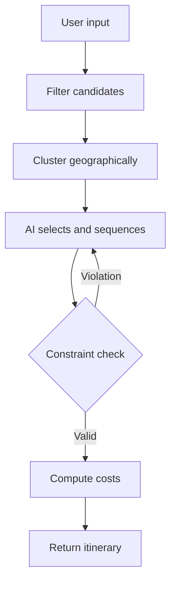
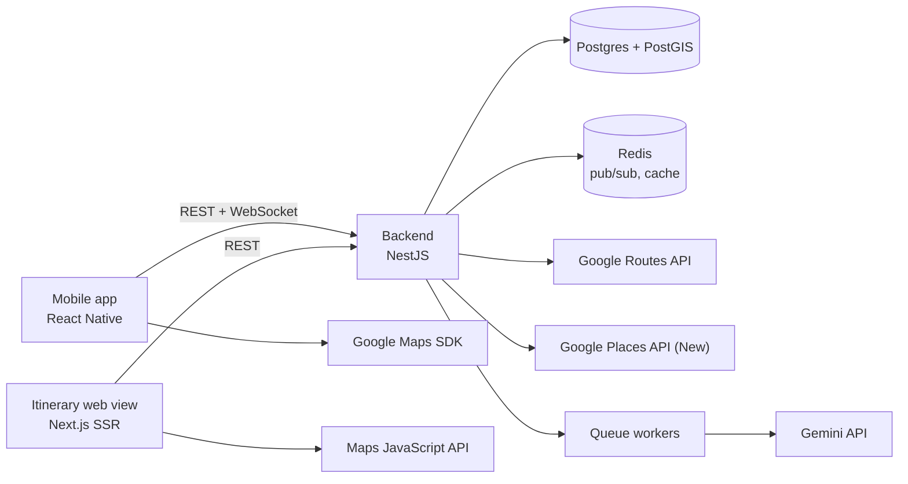

<div align="center">

# 🧭 Rong

### *Rong thong dong.*

**Discover places and build travel itineraries across Vietnam — in seconds, not hours.**

[](#-tech-stack)
[](#-tech-stack)
[](#-ai-itineraries--or-do-it-yourself)
[](#-roadmap)

</div>

---

## 😮‍💨 The problem everyone has

You saved 47 TikToks about Đà Lạt. You scrolled three Facebook review groups. You opened twelve travel blog tabs. And you still ended up typing an itinerary into Notes at 1 AM — not sure if that café is still open, not sure how long it takes to get from A to B, while your group argues in Zalo about what time to leave tomorrow.

**Too much information. Not enough plan.**

## ✨ What Rong does about it

Rong collapses all of that mess into **one map and one itinerary**:

> 🔍 **Search** a destination → see its boundary drawn on the map, with a curated, ranked list of places inside it.
>
> ❤️ **Pick** what you like — or share a TikTok / Facebook / Instagram post straight into the app and let Rong pin the places mentioned in it.
>
> 🤖 **Let AI plan it** around your dates, who's coming, your budget and your pace — complete with meals, real travel times, and cost estimates in VNĐ.
>
> 👥 **Send one link** to the group via Zalo or Messenger. They open it in a browser — no app install — and everyone edits in real time.

From *"let's go to Đà Lạt"* to a finished three-day plan with a budget: **under 20 seconds**.

---

## 🎯 Features

### 🗺️ Browse by destination, not by keyword

| | |
| --- | --- |
| **Search that speaks Vietnamese** | Type `da lat`, get **Đà Lạt**. Typos still work. Old names still work. |
| **Handles the July 2025 province merger** | Search "Bình Thuận" and Rong shows both *Bình Thuận (old)* and *Lâm Đồng (new)*, clearly labeled. Nobody gets lost because an administrative unit was renamed. |
| **Real boundaries on the map** | Once you pick a region, the map zooms to fit it, dims everything outside, and highlights the border. |
| **Hand-drawn tourist polygons** | Đà Lạt, Mũi Né and Hội An are shaped the way **travelers** think of them — not the way the administrative map does. |

### 📍 Map + bottom sheet: skim fast, filter deep

- **Top 5 standout markers** in the current viewport, recomputed every time you pan or zoom.
- **Three-stage bottom sheet** — collapsed / half / full screen — with infinite scroll over every place in the region.
- **Multi-select category chips:** Check-in · Food · Cafés · Nature · Kid-friendly · Culture & history · Nightlife · Stays.
- **Secondary filters:** good for kids / elders / big groups / couples, price level, open now.
- **Two-way sync:** tap a list item and the map flies to its marker; tap a marker and the list scrolls to it.
- Panned away from where you started? A **"Search this area"** button appears.

### 🔥 Rankings with real heat

Every place carries a **composite score (0–100)**, computed entirely from Rong's own signals:

```text
Composite = 0.40 × Editorial score     ← scored by hand during curation
          + 0.30 × Popularity          ← detail views, saves, adds to itineraries
          + 0.30 × Community signal    ← share-to-app activity, last 30 days
```

And Rong **tells you why**: *"Saved 120 times this week."* A **"Trending"** badge lights up when a place suddenly spikes against its own baseline.

### 📲 Share-to-app: turn a TikTok into a pin

See a good video? Hit **Share → Rong**. That's it.

AI reads the link's public metadata, extracts candidate place names, matches them against Rong's catalog, and drops them into your **Saved** list — with an embed of the original post and clear attribution. A *"Top 10 cafés in Đà Lạt"* video? Select all of them at once.

> 🎯 Quality target: **≥ 70%** of valid links correctly resolve at least one place.

### 🧠 AI itineraries — or do it yourself

Choose **AI planning** or **manual planning**, then tell Rong: start and end date/time, who's coming, headcount, where you're staying, budget, pace, transport.

The AI runs a disciplined six-step pipeline:



The key difference: **the AI is not allowed to make things up.** It may only pick from the real catalog, opening hours and prices come from data rather than the model, and after generation a **code-based constraint checker** re-validates opening hours, real travel times and total daily load.

**Group-aware rules** apply automatically:

| Traveling with | Stops/day | Rong will… |
| --- | --- | --- |
| 👨‍👩‍👧 Family with young kids | 3–4 | insert a 2–3 hour midday break, keep each leg ≤ 45 min, prefer kid-friendly places |
| 🎉 Group of friends | 5–7 | pack in photo spots, street food and nightlife |
| 💑 Couples | 4–5 | favor views, atmospheric cafés and sunset spots |
| 👴 With elderly travelers | 3–4 | avoid steep climbs and long walks, build in rest time |

Plus **automatic meal slots** (breakfast 06:30–09:00 · lunch 11:00–13:30 · dinner 17:30–20:30), choosing restaurants near the surrounding stops and within budget.

A place that doesn't fit isn't quietly dropped — it lands in an **"Couldn't schedule"** list with the reason, so you can drag it in yourself.

### 💸 Costs in VNĐ, no hand-waving

A **low–high range**, shown **per person** and **per group**, broken into four categories: attraction tickets · food · local transport · accommodation. Every figure is labeled *"Estimate"* with a data freshness date, and **recalculates the moment the itinerary changes**.

### ✏️ Edit an itinerary like a playlist

- **Drag and drop** to reorder within a day or move a stop to another day.
- **"Swap for something similar"** — three nearby alternatives of the same type, matched to your group.
- **Edit in plain language:** *"Fewer cafés, add somewhere the kids can run around on day 2 afternoon"* → preview the changes before applying them.
- **Smart warnings** (advisory, never blocking): this place is closed at that hour, this leg takes over 60 minutes, this day exceeds 10 active hours, this day has no dinner.
- **10-step undo** and **autosave**.

### 👥 Group trips without the Zalo argument

- Create a group, **invite by link**, share straight to Zalo or Messenger with a proper preview card.
- Invitees **open the itinerary on the web — no app install required**.
- **Roles:** Owner · Editor · Viewer.
- **Real-time sync in ≤ 2 seconds**, with a simple "who changed what" activity log.
- A **shared shortlist** so the whole group can heart places before anything gets scheduled.

### 🚪 Try it without signing up

Search, browse places, build one itinerary — no account needed. Sign in (Google / Apple / phone OTP) only when you want to save long-term, share, or create a group. Changed your mind? **Delete your account and all your data from inside the app.**

---

## 🧰 Tech stack

The whole stack is **TypeScript end to end** — one language across mobile, web and backend.



| Layer | Technology | Why |
| --- | --- | --- |
| 📱 **Mobile** | React Native | One codebase for iOS 17+ and Android 10+ |
| 🌐 **Web** | Next.js (SSR) + Maps JavaScript API | Rich Open Graph previews in Zalo/Messenger; viewable without the app |
| 🗺️ **Maps** | Google Maps SDK (`react-native-maps`, Google provider) | Old/new boundaries rendered as polygon overlays from our own data |
| ⚙️ **Backend** | NestJS (TypeScript) | The **single** entry point for app and web: business logic, authorization, outbound services |
| 🗄️ **Database** | PostgreSQL + **PostGIS** | Spatial queries — "which places fall inside this polygon?" is the heart of the discovery flow |
| 🔎 **Search** | Postgres full-text + `unaccent` (or Meilisearch/Typesense) | Diacritic-free input, typo tolerance |
| ⚡ **Real-time** | NestJS WebSocket Gateway (Socket.IO) + Redis adapter | Group itinerary sync that scales across backend instances |
| 🧠 **AI** | **Gemini API** (paid tier) | Place extraction, itinerary sequencing, community summaries, natural-language edits |
| 🛣️ **Routing** | Google Routes API (Compute Route Matrix) | Real travel-time matrices between stops |
| 🔐 **Auth** | NestJS + Passport/JWT | Google / Apple / SMS OTP, access + refresh tokens |
| 📊 **Analytics** | PostHog · Amplitude · Firebase Analytics | Funnel tracking from search → share → install |

> **Architectural rule:** clients **never** talk to the database directly. Everything goes through the NestJS backend — business logic and permissions live in one place, and the database provider can be swapped without a client ever noticing.

### 🧱 Data that's built, not scraped

Rong's place catalog is a first-party asset, assembled ahead of time by a **background pipeline** and refreshed on a schedule:

```text
Ingest  →  AI extraction  →  Deduplication  →  place_id matching
        →  Region assignment via first-party coordinates  →  Human curation
        →  Composite scoring
```

Sources: **OpenStreetMap** (ODbL) · **Wikidata** (CC0) · Wikivoyage · the National Tourism Administration and provincial tourism portals · Foursquare · YouTube Data API · user share-to-app · and **manual curation**, the highest-quality source for the first five destinations.

**No scraping of Facebook, Instagram or TikTok.** Third-party content is always shown as an embed or a link, with attribution.

### ⚖️ Google Maps Platform compliance, taken seriously

This isn't a footnote — it's a design constraint running through the whole product:

- Google content is **only ever displayed on a Google map** (Maps SDK on mobile, Maps JS API on web).
- **No Google content is stored**, except `place_id` (indefinitely) and coordinates (cached ≤ 30 days). Everything else is fetched **in real time through the backend**.
- Names and coordinates in the first-party catalog come from **non-Google sources**; polygon filtering uses **only** those coordinates.
- **Composite scores and every sort order use first-party signals only** — Google ratings appear solely on the detail screen, visually separated and attributed to Google Maps.
- Google data reaches the AI for **exactly one purpose**: sequencing travel itineraries — minimal fields, never logged, never stored, never used for training.
- Cost is controlled with **field masks**, **session tokens**, Place Details calls only when a user actually opens a place, plus quotas and budget alerts in the Google Cloud Console.

---

## 📐 Quality bar

| Metric | Target |
| --- | --- |
| ⚡ App launch → map ready | ≤ 3 s |
| 🗺️ Boundary + pins rendered (4G) | ≤ 2 s |
| 🎚️ Filter change | ≤ 500 ms |
| 🤖 Itinerary generation (p90) | ≤ 20 s, streamed day by day |
| 📜 List scroll & map pan | ≥ 55 fps on mid-range devices |
| 🔄 Group real-time sync | ≤ 2 s |
| 🧾 Hallucinated places in itineraries | **0%** |
| 🕐 Items not violating opening hours | ≥ 95% |
| 📦 Curated places per destination at launch | ≥ 150 |

Plus: ≥ 99.5% uptime · dynamic type, sufficient contrast and screen-reader labels · compliance with Vietnam's Personal Data Protection Law (effective 1 Jan 2026).

---

## 🚀 Roadmap

```text
Phase 0 — Discovery      3–4 weeks    15–20 user interviews · legal review · Figma prototype
Phase 1 — Data           6–8 weeks    Polygons + aliases · old/new boundaries · curate 5 destinations
Phase 2 — Build MVP     10–12 weeks   F1 → F11
Phase 3 — Closed beta       4 weeks   200–500 users · measure · fix
Phase 4 — Launch               —      Ahead of a long public holiday
```

**First five destinations:** 🌲 Đà Lạt · 🏖️ Vũng Tàu · 🏝️ Phú Quốc · 🌉 Đà Nẵng – Hội An · 🏙️ Ho Chi Minh City (central districts)

> Great data for five destinations beats mediocre data for the whole country.

**Queued for V2:** multi-destination trips and multiple stays · in-group voting and comments · bill splitting · packing checklists · live "On the trip" mode · offline maps · booking affiliates for stays, tickets and tours.

---

## 📊 North Star

> **Itineraries saved and shared with at least one other person, per week.**

Because an itinerary only really matters once the whole group is looking at the same one.

---

## 📦 Repository layout

```text
rong/
├── apps/
│   ├── mobile/          Expo SDK 57 · React Native 0.86 · expo-router
│   ├── web/             Next.js 16 App Router · Tailwind 4
│   └── backend/         NestJS 12 · TypeORM · PostGIS
├── packages/
│   └── shared-types/    The data contract shared by all three apps
├── infra/
│   └── docker-compose.yml   PostGIS 16 + Redis 7
└── docs/PRD-Rong.md
```

Inside `apps/backend/src/modules/`, every folder maps to a feature group in the
PRD — see [the module map](./apps/backend/src/modules/README.md). One rule worth
knowing up front: **`modules/google/` is the only place allowed to call Google
APIs.** The PRD's compliance constraints (store nothing but `place_id`, cache
coordinates ≤ 30 days, never rank on Google data) are only auditable if those
calls live behind a single door.

## 🏁 Getting started

Requires **Node 20+**, **pnpm**, and **Docker** for local Postgres and Redis.

```bash
pnpm install

# Start Postgres + PostGIS and Redis
pnpm infra:up

# Backend — copy env, run migrations, start on :3001
cp apps/backend/.env.example apps/backend/.env
pnpm --filter @rong/backend migration:run
pnpm --filter @rong/backend start:dev

# Web — :3000
pnpm --filter @rong/web dev

# Mobile — Metro bundler, then open in Expo dev client
pnpm --filter @rong/mobile start
```

Verify the backend and its database wiring in one call:

```bash
curl http://localhost:3001/api/health
```

A healthy response reports the live PostGIS version — not just that Postgres
accepted a connection, since a database without the `postgis` extension would
break the entire discovery flow.

### Workspace tasks

| Command | Does |
| --- | --- |
| `pnpm build` | Build every app through Turborepo |
| `pnpm typecheck` | Type-check every workspace |
| `pnpm lint` | Lint every workspace |
| `pnpm test` | Run all test suites |
| `pnpm infra:up` / `infra:down` | Start / stop Postgres + Redis |

### Environment variables

Each app ships a `.env.example`. Copy it to `.env` and fill in the blanks — no
API keys are committed to this repository, and the mobile Google Maps keys are
read at Expo config evaluation time from `apps/mobile/.env`.

## 📄 Documentation

- [`docs/PRD-Rong.md`](./docs/PRD-Rong.md) — the full Product Requirements Document (in Vietnamese): user stories, F1–F11 specs, data model, compliance principles, analytics, risks.
- [`apps/backend/src/modules/README.md`](./apps/backend/src/modules/README.md) — backend module map, folder by folder.

## 🙏 Attribution

Map and boundary data: **© OpenStreetMap contributors** (ODbL) · **Wikidata** (CC0).
Photos, reviews, opening hours and live place information: **Google Maps Platform**.

<div align="center">

---

**Rong** — *Rong thong dong.*

</div>
